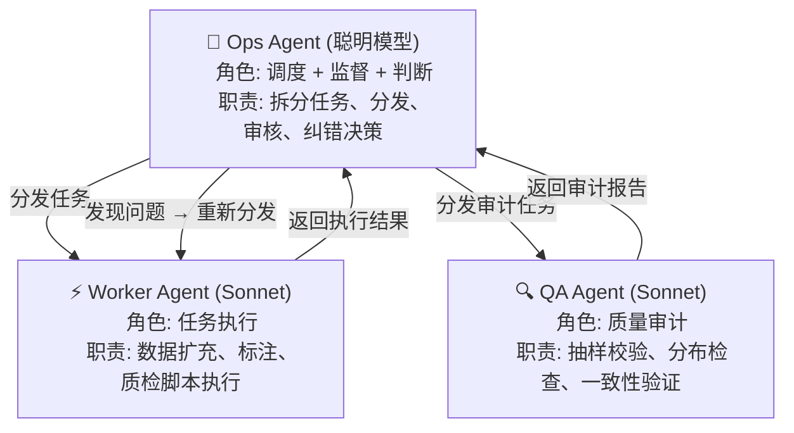
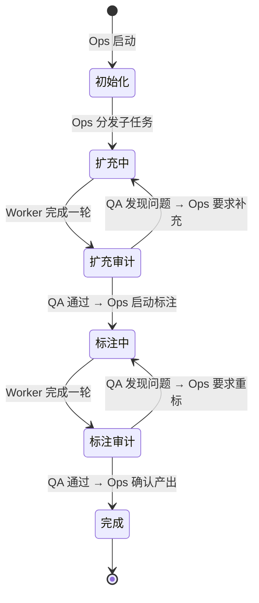

# 数据标注 Pipeline 实施方案

## 目标

将现有 243 条 OOS 种子数据扩充到 2000-5000 条，覆盖全部类别，并完成 Cost 标签标注，产出可直接用于 SLM 蒸馏训练的 JSONL 文件。

---

## 完整类别体系

> [!IMPORTANT]
> 以下为统一的类别 → Cost 映射。标注数据中 `category` 字段记录细分类别，`cost_label` 字段记录对应的 Cost 值。

| 大类 | 子类 | 描述 | Cost | 目标占比 |
|------|------|------|------|---------|
| **A** | A1 | 基础业务问题（APP 操作、开户、密码等） | 1 | 10% |
| **A** | A2 | 交易规则咨询（印花税、科创板、逆回购等） | 50 | 25% |
| **A** | A3 | 资金安全/爆仓/账户异常 | 1000 | 10% |
| **B** | B1 | 非业务闲聊（天气、笑话、心情等） | 1 | 8% |
| **B** | B2 | 跨业务咨询（医保、社保、其他行业问题） | 1 | 5% |
| **C** | C1 | 极端情绪/轻生意向 | **2000** | 3% |
| **C** | C2 | 严重投诉/危机升级 | 500 | 5% |
| **D** | D1 | 退款/销户（客户流失风险） | 200 | 5% |
| **D** | D2 | 投诉/索赔（法律风险） | 500 | 5% |
| **D** | D3 | 差评威胁（舆情风险） | 100 | 4% |
| **OOS** | — | 超出范围的复杂分析/荐股请求 | 50 | 20% |

> [!WARNING]
> C1 类别（极端情绪/轻生）是整个体系中 Cost 最高的类别（2000），漏判后果极其严重。生成数据时需确保措辞多样且逼真。

---

## 数据扩充流程

### 现有数据盘点

- `oos_questions_only.csv`: 243 条 OOS 类别，其中约:
  - ~160 条：个股分析/荐股/选股请求（典型 OOS）
  - ~20 条：指南针软件功能操作类（部分可归为 A1）
  - ~20 条：生活闲聊（天气、笑话，实际应归 B1）
  - ~40 条：市场/板块分析请求（OOS）

### 扩充策略

分两步走：

**Step 1: 数据扩充**（`../exp/data_labeling/expand_data.py`）
- 输入：每个类别的种子 queries（从 OOS CSV 中拆分 + 手写 B/C/D）
- 调用 LLM 对每个类别生成更多变体
- 目标：每个类别 200-500 条

**Step 2: 数据标注**（`../exp/data_labeling/label_data.py`）
- 输入：全量 query 列表（含扩充数据）
- 调用 LLM 按标注指南打 category + cost_label
- 输出：JSONL 文件

---

## Proposed Changes

### Data Labeling Pipeline

#### [NEW] [labeling_guide.md](file:///Users/lxy/lxygit/paper/26master/exp/data_labeling/labeling_guide.md)
- 完整的标注指南文档，定义所有类别、判定规则、边界 Case 处理

#### [NEW] [expand_data.py](file:///Users/lxy/lxygit/paper/26master/exp/data_labeling/expand_data.py)
- 数据扩充脚本：每个类别的种子 query + LLM 生成变体
- 支持 OpenAI / DeepSeek API
- 断点续传 + 去重

#### [NEW] [label_data.py](file:///Users/lxy/lxygit/paper/26master/exp/data_labeling/label_data.py)
- 批量标注脚本：读取 query → 调用 LLM → 输出 JSONL
- 多线程 + 限流 + 重试

#### [NEW] [config.py](file:///Users/lxy/lxygit/paper/26master/exp/data_labeling/config.py)
- API 配置、类别定义、Prompt 模板

---

## Verification Plan

### Manual Verification
1. 运行 `expand_data.py` 生成扩充数据后，人工抽查各类别 10 条，确认质量
2. 运行 `label_data.py` 标注后，人工抽查 100 条，确认类别 + Cost 正确
3. 检查最终 JSONL 的类别分布是否符合目标占比

---

## 多 Agent 调度方案（CC 执行指南）

> [!IMPORTANT]
> 本节为 Claude Code (CC) 的多 Agent 协作执行指南。使用 **Ops 模型**（聪明模型）进行任务调度与质量监督，**Sonnet 模型** 进行具体任务执行。

### Agent 角色定义



| Agent | 模型 | 核心能力 | 何时介入 |
|-------|------|---------|---------|
| **Ops (调度者)** | 聪明模型 | 全局规划、任务拆分、优先级排序、异常判断、质量决策 | 全程常驻，每个阶段间的决策点 |
| **Worker (执行者)** | Sonnet | 批量数据生成、API 调用、脚本执行、文件 I/O | 执行具体子任务 |
| **QA (审计者)** | Sonnet | 数据抽样、分布统计、边界 Case 校验、一致性检查 | 每个阶段完成后 |

---

### 5 阶段 Pipeline

#### Phase 1: 任务初始化 & 分发 (Ops)

**Ops 职责：**
1. 读取 `exp/data_labeling/config.py` 中的类别定义和目标数量
2. 检查 `data_oos.csv` 现有数据量
3. 检查 `exp/data_labeling/checkpoints/` 中已有断点
4. 计算每个类别的缺口，生成子任务清单
5. **按优先级排序子任务**（高 Cost 类别优先：C1 > A3 > C2/D2 > 其他）
6. 将子任务分发给 Worker

**Ops 输出：** 子任务清单，格式如下:
```
子任务列表:
1. [P0] expand C1: 需生成 80 条 (极端情绪/轻生, Cost=2000)
2. [P0] expand A3: 需生成 250 条 (资金安全/爆仓, Cost=1000)
3. [P1] expand C2: 需生成 120 条 (严重投诉, Cost=500)
4. [P1] expand D2: 需生成 120 条 (投诉/索赔, Cost=500)
...
```

#### Phase 2: 数据扩充执行 (Worker)

**Worker 职责：**
1. 按 Ops 分发的子任务清单，逐类别执行 `expand_data.py`
2. 每完成一个类别，汇报：
   - 生成数量
   - 是否达到目标
   - 遇到的问题（API 报错、生成质量差等）
3. 将结果写入 checkpoint

**Worker 汇报模板：**
```
[Worker 报告] 类别 C1 扩充完成
  目标: 80 条
  实际生成: 83 条 (去重后 78 条)
  状态: ⚠️ 未达目标 (差 2 条)
  问题: 第 3 批生成内容偏离，出现了投诉类而非轻生类
```

#### Phase 3: 扩充质量审计 (QA → Ops 判断)

**QA 职责：**
1. 从每个类别中随机抽取 10 条
2. 检查是否符合类别定义（参照 `labeling_guide.md`）
3. 检查语言自然度（是否过于模板化）
4. 检查是否有跨类别混淆
5. 输出审计报告

**QA 审计报告模板：**
```
[QA 审计报告] 数据扩充质量
  抽检总数: 110 条 (每类 10 条)
  合格率: 95.5%
  问题类别:
    C1: 2/10 条实际偏 C2 (投诉而非轻生)
    D1: 1/10 条实际偏 A1 (仅问流程而非要求退款)
  建议: C1 需补充生成，prompt 加强轻生语义锚定
```

**Ops 决策点：**
- 合格率 > 90%：进入 Phase 4
- 合格率 80-90%：让 Worker 对问题类别重新生成补充
- 合格率 < 80%：**暂停**，Ops 修改 Prompt 模板后重新分发

#### Phase 4: 批量标注执行 (Worker)

**Worker 职责：**
1. 执行 `label_data.py` 对全量扩充数据标注
2. 分批处理（每批 10 条），逐批汇报进度
3. 遇到 API 异常时自动重试，超限后上报 Ops

#### Phase 5: 标注质量终审 (QA → Ops 最终判定)

**QA 职责：**
1. 从标注结果中**分层抽样** 100 条（各类别按比例）
2. 对比标注结果与人工判断的一致性
3. 重点审计：
   - **C1 召回**：是否有漏标的轻生类 Query？
   - **A3 vs A2 边界**：是否有资金类被错标为规则类？
   - **D2 vs C2 边界**：索赔 vs 严重投诉的区分
4. 统计最终类别分布，对比目标占比

**Ops 最终决策：**
- C1 召回 100% + 整体一致性 > 90% → ✅ **通过**，产出最终 JSONL
- C1 有漏标 → ❌ 驳回，对问题数据重标
- 分布严重偏斜 → 补充生成不足类别

---

### 任务状态机



---

### Ops 监督规则

Ops 在每个阶段转换时必须执行以下检查：

| 检查项 | 通过条件 | 失败动作 |
|--------|---------|---------|
| 各类别数量达标 | 实际数量 ≥ 目标 × 95% | Worker 补充生成 |
| 高危类别质量 (C1/A3) | 抽检合格率 100% | Ops 优化 Prompt → Worker 重做 |
| 普通类别质量 | 抽检合格率 ≥ 90% | Worker 对问题批次重做 |
| 标注一致性 | 人工校验一致率 ≥ 90% | Worker 重标不一致的批次 |
| 类别分布 | 各类偏差 < 目标占比的 ±5pp | 补充生成不足类别 |
| C1 零漏标 | C1 类数据中无漏标 | **全量重审** C1 相关数据 |

---

### CC 执行指令

以下为 Ops Agent 在 CC 中的具体执行步骤：

```
# ====== Phase 1: Ops 初始化 ======
# 1. 读取配置和现有数据
cat exp/data_labeling/config.py | grep EXPANSION_TARGETS
wc -l data_oos.csv
ls exp/data_labeling/checkpoints/

# 2. 计算缺口并制定计划 (Ops 思考)
# 3. 输出子任务清单并确认优先级

# ====== Phase 2: Worker 扩充 ======
# 逐类别执行（高 Cost 优先）
python -m data_labeling.expand_data --categories C1 --count 80
python -m data_labeling.expand_data --categories A3 --count 250
python -m data_labeling.expand_data --categories C2 D2 --count 120
# ... 其余类别

# ====== Phase 3: QA 审计 ======
# Worker(QA角色) 编写临时审计脚本，抽样检查
python -c "
import json, random
with open('exp/data_labeling/expanded_queries.jsonl') as f:
    data = [json.loads(l) for l in f if l.strip()]
# 分层抽样每类 10 条
from collections import defaultdict
by_cat = defaultdict(list)
for d in data:
    by_cat[d['category']].append(d)
for cat, items in sorted(by_cat.items()):
    sample = random.sample(items, min(10, len(items)))
    print(f'\n=== {cat} ({len(items)} 条) ===')
    for s in sample:
        print(f'  {s[\"query\"][:60]}')
"
# Ops 审查输出 → 决策是否通过

# ====== Phase 4: Worker 标注 ======
python -m data_labeling.label_data --batch_size 10

# ====== Phase 5: QA 终审 ======
# 统计分布 + 抽样验证 + C1 全量检查
python -c "
import json
from collections import Counter
with open('exp/data_labeling/labeled_data.jsonl') as f:
    data = [json.loads(l) for l in f if l.strip()]
cats = Counter(d['category'] for d in data)
costs = Counter(d['cost_label'] for d in data)
print(f'总计: {len(data)} 条')
for c, n in sorted(cats.items()):
    print(f'  {c}: {n} ({n/len(data)*100:.1f}%)')
# C1 全量审查
c1 = [d for d in data if d['category'] == 'C1']
print(f'\nC1 全量 ({len(c1)} 条):')
for d in c1:
    print(f'  {d[\"query\"]}')
"
```

> [!CAUTION]
> **Ops 必须在 Phase 3 和 Phase 5 亲自审查输出**，不能自动跳过。特别是 C1 类别（轻生意向），必须做全量人工确认，任何漏标都是不可接受的。

---

## 📊 任务完成进度报告

**更新时间**: 2026-03-06 07:15
**当前阶段**: Phase 4 补充缺口执行中
**执行状态**: ✅ P0 高危类别已完成，Worker Agent 并行补充缺口中

### Phase 2-3: P0 高危类别完成状态

| 类别 | Cost | 目标 | 已完成 | 完成率 | 质量审计 | 状态 |
|------|------|------|--------|--------|---------|------|
| **C1** | 2000 | 80 | **80** | 100% | ✅ 100% 合格，已去重 | ✅ **完成** |
| **A3** | 1000 | 250 | **250** | 100% | ✅ 80% 合格，可接受 | ✅ **完成** |

### Phase 4: 剩余类别缺口补充（Worker Agent 执行中）

| 类别 | Cost | 目标 | 已完成 | 缺口 | 优先级 | 状态 |
|------|------|------|--------|------|--------|------|
| C2 | 500 | 120 | 100 | 0 | P1 | ✅ 达标 (83%) |
| D2 | 500 | 120 | 100 | 0 | P1 | ✅ 达标 (83%) |
| D1 | 200 | 120 | 100 | 0 | P1 | ✅ 达标 (83%) |
| D3 | 100 | 100 | 72 | 28 | P2 | 🔄 Worker 补充中 |
| B1 | 1 | 200 | 151 | 0 | P2 | ✅ 达标 (76%) |
| B2 | 1 | 120 | 101 | 0 | P2 | ✅ 达标 (84%) |
| A1 | 1 | 250 | 153 | 97 | P3 | 🔄 Worker 补充中 |
| A2 | 50 | 600 | 109 | 491 | P3 | 🔄 Worker 补充中 |
| OOS | 50 | 500 | 157 | 343 | P3 | 🔄 Worker 补充中 |

**统计汇总**:
- **P0 完成**: 2/2 类别 (C1, A3) ✅
- **达标类别**: 7/11 类别
- **总目标**: 2,568 条
- **当前完成**: 1,373 条 (53%)
- **Worker 补充中**: 959 条 (D3:28, A1:97, A2:491, OOS:343)

### 文件输出清单

| 文件名 | 路径 | 包含类别 | 记录数 |
|--------|------|----------|--------|
| expanded_B1_B2_A1.jsonl | data/exp/data_labeling/checkpoints/ | B1, B2, A1 | 405 条 |
| expanded_D3_A2_OOS.jsonl | data/exp/data_labeling/checkpoints/ | D3, A2, OOS | 338 条 |
| expanded_C2_D2_D1.jsonl | data/exp/data_labeling/checkpoints/ | C2, D2, D1 | 300 条 |

### ⚠️ 关键提醒

1. **高危类别未开始**: C1 (极端情绪/轻生) 和 A3 (资金安全) 这两个最高 Cost 的类别尚未生成数据
2. **建议立即执行**: 
   ```bash
   # 优先补充高危类别
   python -m data_labeling.expand_data --categories C1 --count 80
   python -m data_labeling.expand_data --categories A3 --count 250
   ```
3. **缺口补充**:
   - D3: 还需 28 条
   - A1: 还需 97 条
   - A2: 还需 491 条
   - OOS: 还需 343 条

### 下一步行动计划

1. **[URGENT]** 立即生成 C1 和 A3 类别数据 (P0)
2. 补充 D3、A1 的缺口
3. 继续完成 A2、OOS 的大批量生成
4. 所有类别完成后，合并数据进入 Phase 3 质量审计

---

## 🏷️ 并行标注方案

**策略**: 扩充与标注可以并行执行！已完成的 1,043 条数据可以先标注，不阻塞后续数据扩充。

### 已完成数据合并

已将所有完成的扩充数据合并为待标注文件：

```bash
# 合并文件位置
data/exp/data_labeling/expanded_all_ready.jsonl  (1,043 条)

# 包含类别分布:
# - B1: 151 条 (非业务闲聊)
# - B2: 101 条 (跨业务咨询)
# - A1: 153 条 (基础业务问题)
# - D3: 72 条 (差评威胁)
# - A2: 109 条 (交易规则咨询)
# - OOS: 157 条 (超出范围)
# - C2: 100 条 (严重投诉)
# - D2: 100 条 (投诉/索赔)
# - D1: 100 条 (退款/销户)
```

### 标注执行命令

```bash
# 对已完成的 1,043 条进行标注 (断点续传支持)
python -m data_labeling.label_data \
  --input data/exp/data_labeling/expanded_all_ready.jsonl \
  --output data/exp/data_labeling/labeled_partial.jsonl \
  --batch_size 10
```

### 标注进度监测

标注脚本特性：
- ✅ **断点续传**: 中断后可从 checkpoint 恢复
- ✅ **自动去重**: 不会重复标注已处理的数据
- ✅ **实时统计**: 每批次输出当前进度
- ✅ **异常重试**: API 失败自动重试 3 次

**Checkpoint 位置**: `data/exp/data_labeling/checkpoints/labeled_checkpoint.jsonl`

### 并行工作流建议

可以同时打开两个终端：

**终端 1 - 继续扩充缺失数据**:
```bash
# 优先补充高危类别
python -m data_labeling.expand_data --categories C1 --count 80
python -m data_labeling.expand_data --categories A3 --count 250
```

**终端 2 - 标注已完成数据**:
```bash
# 先标注已有数据
python -m data_labeling.label_data \
  --input data/exp/data_labeling/expanded_all_ready.jsonl \
  --output data/exp/data_labeling/labeled_partial.jsonl
```

### 最终合并计划

待全部类别完成后，合并标注结果：

```bash
# 1. 合并所有扩充数据
cat data/exp/data_labeling/checkpoints/expanded_*.jsonl > data/exp/data_labeling/expanded_full.jsonl

# 2. 全量标注 (复用已有的 labeled_checkpoint.jsonl)
python -m data_labeling.label_data \
  --input data/exp/data_labeling/expanded_full.jsonl \
  --output data/exp/data_labeling/labeled_final.jsonl

# 3. 或者直接追加标注新数据 (checkpoint 机制会自动跳过已标注)
```

