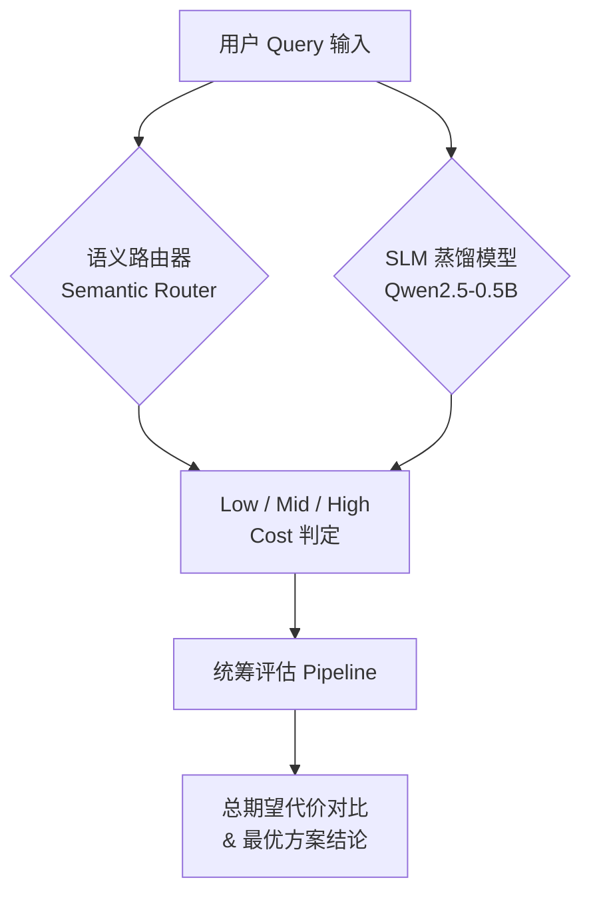
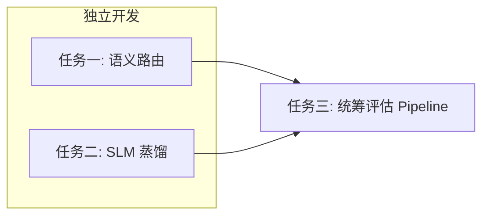
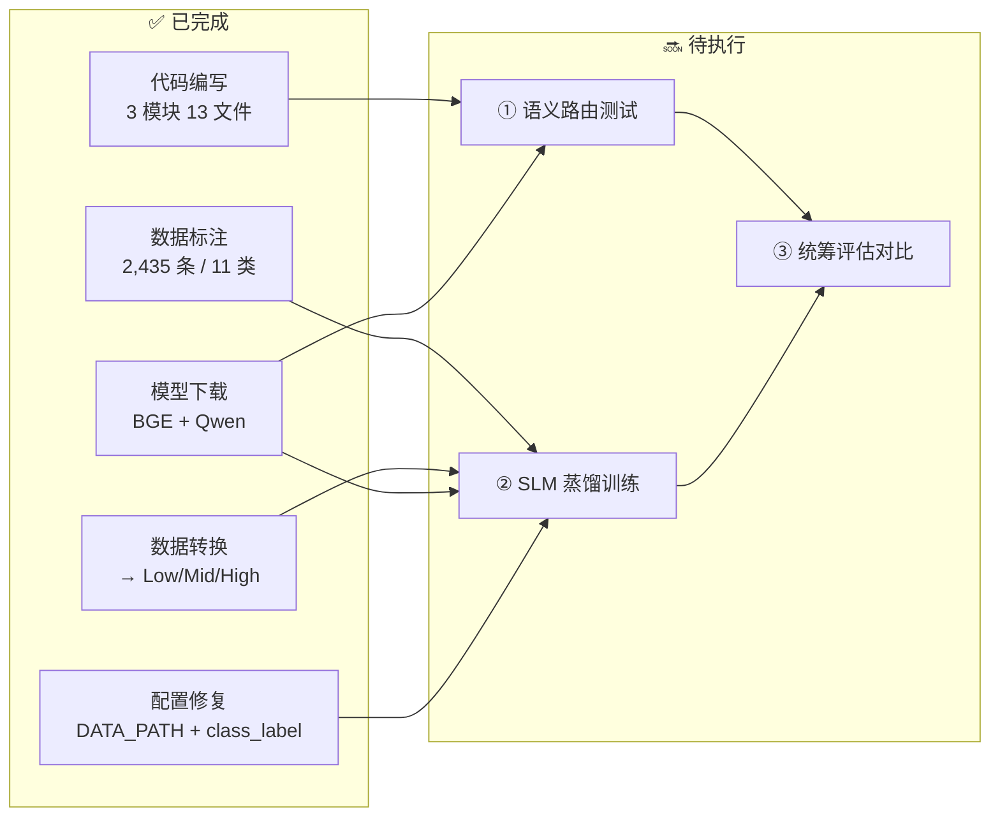

# 需求分析 Walkthrough：非对称代价感知的金融客服智能路由系统

## 项目进展
代码已全部实现，共创建 13 个源文件，涵盖三个模块：

任务一 · 语义路由 (semantic_routing/)

router.py — 基线余弦路由 + 非对称代价惩罚（τ_high=0.7 强制拦截高危）
anchors.py — 3 级 × 15 条 = 45 条锚点 Query
test_routing.py — 50 条测试 Query，可直接运行（首次会自动下载 bge 模型）
任务二 · SLM 蒸馏 (slm_distillation/)

asymmetric_loss.py — 回归版 + 分类版非对称损失（α=10 惩罚漏报）
trainer.py — 自定义 Trainer，重写 compute_loss
train.py — 完整 LoRA 训练流程（DATA_PATH 留空，你的标注数据就绪后填入路径即可运行）
inference.py — 推理 + TTFT 测量
任务三 · 统筹评估 (evaluation/)

evaluate.py — 统一评测框架，含 Demo 测试集，可单独跑语义路由评估
现在可以运行的命令（仅语义路由，不依赖标注数据）：

bash
cd /Users/lxy/lxygit/paper/26master
pip install -r requirements.txt
python -m semantic_routing.test_routing
标注数据就绪后，将 JSONL 路径填入 slm_distillation/config.py 的 DATA_PATH，即可启动训练。


## 项目总览

本项目旨在构建一个面向**金融/股票客服场景**的智能路由系统，核心创新在于引入**非对称代价（Asymmetric Cost）** 机制——"宁可误报，绝不漏报高危"。系统包含三大模块，形成完整的从路由到蒸馏再到评估的闭环。



---

## 模块一：非对称代价感知的语义路由 (Semantic Routing)

### 定位与目标

| 属性 | 说明 |
|------|------|
| **类型** | 免训练、基于向量检索的路由分类器 |
| **延迟要求** | 单条 Query < 10 ms |
| **核心创新** | 非对称代价惩罚——对 High Cost 锚点设置低阈值 τ，强制拦截高危 |

### 技术方案

1. **锚点字典构建**：手工编写 3 个风险等级（Low/Mid/High）的代表性 Query，每级 10-20 条
2. **Embedding 模型**：`BAAI/bge-small-zh-v1.5`（~100MB，CPU 可运行）
3. **基线逻辑**：余弦相似度 → 取最大相似度对应的风险等级
4. **创新逻辑**：当 Query 与 High Cost 锚点相似度 > τ_high（如 0.7）时，**直接判定为高危**，跳过标准路由

$$\text{Cost}_{final} = \begin{cases} 1000, & \text{if } \max(\text{Sim}(v_q, \text{High})) > \tau_{high} \\ \text{Base\_Routing}(v_q), & \text{otherwise} \end{cases}$$

### 验收标准

- 50 条测试 Query 输出 Cost
- 单条处理 < 10 ms

---

## 模块二：非对称代价 SLM 知识蒸馏 (SLM Distillation)

### 定位与目标

| 属性 | 说明 |
|------|------|
| **类型** | 基于 LoRA 微调的 0.5B 小模型 |
| **延迟要求** | 首字延迟 TTFT < 50 ms |
| **准确率要求** | 高危问题召回率 Recall > 95% |
| **核心创新** | 非对称损失函数——漏报高危时施加 α=10 的惩罚 |

### 技术方案

1. **数据准备**：2000-5000 条无标注金融客服对话，通过调用 LLM API（OpenAI/DeepSeek）批量标注 Cost
2. **输出**：JSONL 文件 `{"query": "...", "cost_label": 50}`
3. **底座模型**：`Qwen/Qwen2.5-0.5B` 或 `Qwen/Qwen2.5-1.5B`
4. **微调方式**：LoRA（`peft` 库）
5. **创新 Loss**：重写 `compute_loss`，实现非对称损失

$$L = \frac{1}{N} \sum_{i=1}^{N} \left[ \alpha \cdot \max(0, y_i - \hat{y}_i)^2 + \max(0, \hat{y}_i - y_i)^2 \right]$$

> [!IMPORTANT]
> 漏报（$\hat{y} < y$）惩罚权重 α=10，误报（$\hat{y} ≥ y$）权重为 1。这是整个系统"金融保守性"的关键体现。

### 验收标准

- 单卡（T4/3090）可跑通训练
- TTFT < 50 ms
- 高危 Recall > 95%

---

## 模块三：统筹评估 Pipeline (Evaluation)

### 定位与目标

将模块一和模块二放入统一评测框架中进行对比，得出**总期望代价最优方案**。

### 技术方案

1. **测试集构成**：20% 闲聊（Low）+ 70% 基础查询（Mid）+ 10% 极高危（High）
2. **模拟高并发队列**：设定基础延迟代价和人工转接代价 $C_{human}$
3. **记录指标**：
   - 处理耗时 → 影响实时延迟期望
   - 分发错误数量 → 影响错误代价期望
4. **最终结论**：在不等式模型下，计算两种方法的整体总损失，选出最优

---

## 模块间依赖关系



> [!NOTE]
> 任务一和任务二可以**并行开发**，任务三依赖前两个模块的完成。


# Walkthrough：非对称代价感知金融客服路由系统

## 当前进度总览



---

## ✅ 已完成清单

| 里程碑 | 产出 |
|--------|------|
| 代码编写 | 3 模块 13 文件（语义路由/SLM蒸馏/评估Pipeline） |
| 数据扩充 + 标注 | 2,435 条，11 类别 (A1/A2/A3/B1/B2/C1/C2/D1/D2/D3/OOS) |
| 数据格式转换 | JSONL → 分类任务格式 (class_label: 0=Low, 1=Mid, 2=High) |
| 模型下载 | `BAAI/bge-small-zh-v1.5` (~100MB) + `Qwen/Qwen2.5-0.5B` (~1GB) |
| 配置更新 | `DATA_PATH` 已填入，脚本适配 `class_label` 字段 |

---

## 🔜 后续步骤详解

### Step ①：运行语义路由模块（⏱ 预计 5 分钟）

**不需要 GPU，可立即执行。**

```bash
cd /home/iilab9/scholar-papers/experiments/intention/exp-2
uv run python -m semantic_routing.test_routing
```

**预期输出：**
- 50 条测试 Query 的表格（Query → 预测Level → Cost → 延迟 → 各级相似度）
- 统计摘要：分布、平均延迟、P99 延迟
- 验收判断：全部延迟是否 < 10ms

**检查要点：**
1. **延迟**：每条 < 10ms（第一条可能稍慢因为模型热身）
2. **高危判定**：所有高危 Query 是否被正确拦截
3. **τ_high 阈值**：如果误报(false positive)太多 → 调高 `config.py` 中的 `TAU_HIGH`；如果漏报 → 调低

**如果有问题需要调参：**
```python
# semantic_routing/config.py
TAU_HIGH = 0.70  # ← 调整此值
# 建议范围: 0.65 ~ 0.80
# 偏低 → 更保守（宁可误报）
# 偏高 → 更宽松（减少误报但可能漏报）
```

---

### Step ②：运行 SLM 蒸馏训练（⏱ 预计 30-60 分钟）

**需要 GPU**

```bash
cd /home/iilab9/scholar-papers/experiments/intention/exp-2
uv run python -m slm_distillation.train
```

**训练过程监控：**
- Epoch 1/3, 2/3, 3/3 的 train_loss 应逐步下降
- 每个 epoch 结束后打印 validation 指标（accuracy, recall_low/mid/high）
- **核心指标：`recall_high` 必须 > 95%**

**预期产出：**
- `output/slm_distillation/` 目录下的 LoRA adapter 权重
- 训练日志（loss 曲线）
- 测试集评估报告

**如果 recall_high 不达标：**
1. 增大漏报惩罚：`slm_distillation/config.py` → `ALPHA_UNDERPREDICT = 20`（默认 10）
2. 或增加训练轮数：`NUM_EPOCHS = 5`
3. 或检查数据中 High Cost 样本是否充足（应有 ~250 条 A3 + C1 + C2 + D2）

**训练完成后验证推理：**
```bash
# 单条测试
uv run python -m slm_distillation.inference --query "为什么强平我的仓位"
uv run python -m slm_distillation.inference --query "怎么修改密码"
uv run python -m slm_distillation.inference --query "亏光了不想活了"

# 在测试集上评估
uv run python -m slm_distillation.inference --test_file data/processed/final_labeled_data.jsonl
```

**检查要点：**
1. **TTFT < 50ms**
2. **高危 Recall > 95%**（C1/A3 类不能漏判）
3. 各等级的 Precision / Recall / F1

---

### Step ③：统筹评估对比（⏱ 预计 10 分钟）

**Step ① 和 ② 都完成后执行。**

```bash
# 仅评估语义路由（可在 Step ① 完成后先跑）
uv run python -m evaluation.evaluate --methods routing

# 两者对比（需 Step ② 完成）
uv run python -m evaluation.evaluate --methods both

# 使用真实标注数据作为测试集
uv run python -m evaluation.evaluate --methods both --test_file data/processed/final_labeled_data.jsonl
```

**预期输出：**
- 两种方法的并排对比表：准确率、高危 Recall、漏报/误报数、延迟、错误代价
- **★ 总期望代价 (Total Expected Cost)**：数值越小越优
- 最终结论：哪种方法整体总损失最小

**评估结论用于论文：**
- 语义路由优势：延迟极低 (< 10ms)，免训练
- SLM 蒸馏优势：更细粒度分类，可学习复杂边界
- 总期望代价的不等式分析

---

## 关键决策检查点

| 执行后 | 检查 | 正常 | 异常处理 |
|--------|------|------|---------|
| Step ① | 延迟 < 10ms？ | 继续 | 检查模型是否在 GPU 上跑（应该用 CPU） |
| Step ① | 高危全捕获？ | 继续 | 降低 τ_high (0.65) |
| Step ② | loss 下降？ | 继续 | 检查数据格式、学习率 |
| Step ② | recall_high > 95%？ | 继续 | 增大 α 或增加 epoch |
| Step ② | TTFT < 50ms？ | 继续 | 检查是否用了 GPU 推理 |
| Step ③ | 两方法对比完成？ | 写论文 | 检查 adapter 路径 |
